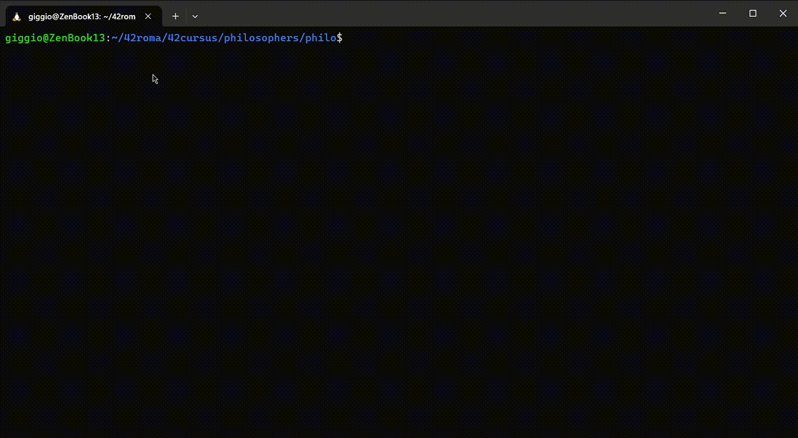
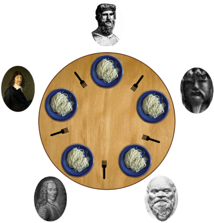

# Philosophers 

## My Execution
Parameter: [num_of_philos] [time_to_die] [time_to_eat] [time_to_sleep] [num_of_meals]  
Output: [timestamp] [philo_id] [action]

## The Problem
The dining philosophers problems is a typical exercise to learn to develop a concurrent algorithm.  
There are N philosopher sit around a table and there are N forks on the table, each philospher has to eat before he dies to starvation but each philosopher needs 2 forks to eat so sometimes they must wait that the other philosophers finish to eat to take the forks.  
  
For more info visit the following -> [site](https://www.geeksforgeeks.org/dining-philosopher-problem-using-semaphores)

