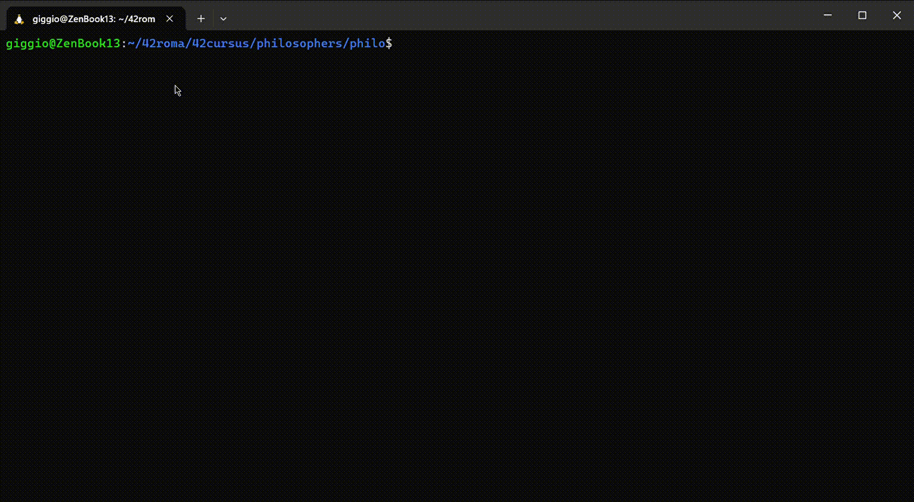
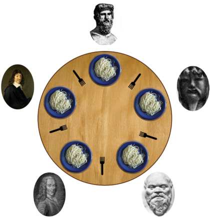

# Philosophers

## Overview
Created a program in C that simulates the behavior of N concurrent threads based on the famous Dining Philosophers Problem.

## Execution Details
### Parameters:
```
[num_of_philos] [time_to_die] [time_to_eat] [time_to_sleep] [num_of_meals]
```
### Output Format:
```
[timestamp] [philo_id] [action]
```


## Responsibilities
- Sole developer, responsible for multithreading logic and synchronization.

## Technologies Used
- C

## Challenges Faced
- Implementing concurrency
- Avoiding deadlocks
- Optimizing thread synchronization

## Outcome
Successfully created a working simulation of the Dining Philosophers Problem.

## The Problem
The Dining Philosophers Problem is a classic exercise in concurrent programming.
N philosophers sit around a table with N forks, each needing two forks to eat. If a philosopher cannot acquire both forks, they must wait until one becomes available, creating a need for careful synchronization.



For more details, visit the following -> [site](https://www.geeksforgeeks.org/dining-philosopher-problem-using-semaphores)

